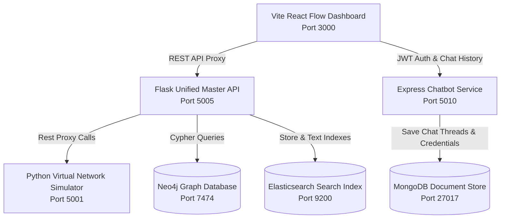

# HPE SAN Unified Platform — Complete User Manual & System Guide

Welcome to the **HPE SAN Unified Platform** User Manual and System Guide. This document is a comprehensive, end-to-end directory of all core architectural systems, page-by-page interactive layouts, button actions, back-end endpoints, and automated pipeline scripts within this repository.

---

## 📖 Table of Contents
1. [Core System Architecture](#1-core-system-architecture)
2. [Database Schema & Ontological Mapping](#2-database-schema--ontological-mapping)
3. [Page-by-Page Feature & Button Directory](#3-page-by-page-feature--button-directory)
   - [Authentication & Multi-Tenant Login](#authentication--multi-tenant-login)
   - [Network Discovery Engine](#network-discovery-engine)
   - [Interactive Testing & Topology Manager](#interactive-testing--topology-manager)
   - [Resource Inventory Explorer](#resource-inventory-explorer)
   - [Interactive Console Terminal Emulator & Modal NodeTerminals](#interactive-console-terminal-emulator--modal-nodeterminals)
   - [HPE SAN AI Assistant (RAG & Agent)](#hpe-san-ai-assistant-rag--agent)
   - [System Health Dashboard](#system-health-dashboard)
   - [Admin Control Panel & Synthetic Faker](#admin-control-panel--synthetic-faker)
4. [Internal Mechanics & Processing Pipelines](#4-internal-mechanics--processing-pipelines)
5. [How to Compile the LaTeX User Manual](#5-how-to-compile-the-latex-user-manual)

---

## 1. Core System Architecture

The monorepo operates on a highly decoupled, service-oriented architecture comprising five distinct application layers coordinating to simulate, discover, analyze, and manage a Storage Area Network (SAN).



### Modular Directory Structure
*   **`api/`** — Unified Flask REST API on Port `5005` serving data controllers for database synchronization.
*   **`simulator/`** — In-process virtual network simulator on Port `5001` that mimics HPE Storage Array (3PAR/Alletra) and Brocade FC Switch command prompt consoles.
*   **`discovery/`** — Multithreaded network crawler running BFS traversals to discover virtual devices, parsing raw terminal outputs into structured data objects.
*   **`chatbot-service/`** — Express.js REST server on Port `5010` managing secure JWT generation and MongoDB chat indexes.
*   **`dashboard/`** — React Flow and Tailwind-driven dashboard UI configured with Vite on Port `3000`.

---

## 2. Database Schema & Ontological Mapping

The topology of the simulated SAN network is managed as a directed property graph inside **Neo4j** and searchable via **Elasticsearch**.

### Entity Schema Attributes
1.  **`ArraySystem`**: Represents the physical storage array (e.g., `ARR-01`). Holds TPD firmware versions, model types, management IPs, and total capacity.
2.  **`Node`**: Refers to the physical controller nodes housed inside the storage array.
3.  **`Port`**: Physical FC or iSCSI port interfaces on controller nodes (e.g., Port `0:3:1`).
4.  **`Switch`**: Fibre Channel (FC) switches driving active fabric routing.
5.  **`Host`**: Compute servers equipped with Host Bus Adapters (HBAs) connected to the storage network.
6.  **`Cage`**: Enclosure shelves holding physical hard disk drives.
7.  **`PhysicalDisk`**: Physical storage media located within cages.

### Relationship Cardinality
```
[ArraySystem] --(HAS_NODE)--> [Node] --(HAS_PORT)--> [Port]
[Port] --(CONNECTS_TO)--> [Host] or [Switch]
[ArraySystem] --(HAS_CAGE)--> [Cage] --(CONTAINS)--> [PhysicalDisk]
```

---

## 3. Page-by-Page Feature & Button Directory

### Authentication & Multi-Tenant Login
The entry portal to the system is protected by secure user logins and maps role-based privileges to team scopes.

*   **``Toggle Form`` Option**: Instantly switches between User Registration (POST `/api/auth/register`) and Authentication (POST `/api/auth/login`).
*   **``Role`` Selector Dropdown**: Sets the user credentials scope:
    *   `team_member`: Locked to viewing devices associated with their dedicated cluster IP mapping.
    *   `manager`: Grants read/write scoping to an array of designated `managedTeams`.
    *   `senior_manager`: Scopes visibility to multiple designated `managedClusters`.
    *   `admin`: Full administrator bypass privileges across all resources.
*   **``Team`` & ``Cluster`` input boxes**: Configures initial scoping tags for the user's login session.
*   **``Submit`` Button**: Validates user inputs, saves account credentials, receives a signed JWT, updates the React state context, and navigates to the core dashboard.

---

### Network Discovery Engine
A live visual operational terminal to run, monitor, and configure BFS network crawl events.

*   **``Graph View`` Button**: Renders a comprehensive, interactive coordinate-based canvas mapping all discovered devices using React Flow.
*   **``Neural View`` Button**: Renders a force-directed spring graph mapping topological clusters dynamically.
*   **``Card Grid View`` Button**: Displays devices as responsive summary grid tiles showing statuses, node categories, and key properties.
*   **``Wipe Database`` Button**: Sends a POST request to `/api/graph/wipe`, executing a Cypher `MATCH (n) DETACH DELETE n` wipe query to clear all nodes and relations in Neo4j, resetting all local UI states.
*   **``Upload Log`` Button**: Launches a file selector. Accepts a raw terminal log file (`.txt`), posts it to `/api/discover/ingest`, parses the content, and registers it as a discovered device under a mock IP.
*   **``Start Discovery`` Button**: Triggers a POST to `/api/discover` starting BFS crawling at seed IP `10.20.10.5`. This opens a live Server-Sent Events (SSE) log panel streaming real-time crawler logs.
*   **``Cancel Discovery`` Button**: Halts a running BFS network crawl safely via POST `/api/discover/cancel`.
*   **``Log`` Button**: Toggles a slide-out sidebar to view incoming raw crawler events in formatted JSON.

---

### Interactive Testing & Topology Manager
An interactive SAN workspace to analyze component dependencies, edit whitelisted property attributes, and decommission elements.

#### Secondary sub-tab options:
1.  **`SAN Diagram`**: Renders a resizable 3-column SAN grid mapping Storage Arrays, Fabric Switches, and Compute Hosts.
2.  **`Visual Map`**: Re-renders selected nodes and edges inside a dynamic visual canvas using React Flow.
3.  **`Decommissioned`**: Houses offline or decommissioned components that are safely hidden from active maps.

#### Core controls and buttons:
*   **``Search Bar``**: Filters visible nodes by name, ID, or IP. Walks parent-child relationships so matching sub-ports keep parent arrays visible.
*   **``Column Resizing Dividers``**: Drag handles placed between columns in the SAN Diagram layout. Dragging resizes columns (`Storage Arrays`, `Switches`, `Hosts`) dynamically.
*   **``Checkbox Node Selection``**: Checkboxes next to cards inside the SAN Diagram let users select specific components. Selecting multiple components highlights all active data path connections on the canvas.
*   **``Export Excel`` Button**: Aggregates discovered SAN properties, formats arrays, and generates a formatted multi-sheet Excel spreadsheet (`.xlsx`) via the sheetjs utility.
*   **``Import Config`` Button**: Opens a local file picker to upload custom JSON configurations, merging nodes and edges directly into the current topology view.
*   **``Simulate Role`` Dropdown (Admin-Only)**: Instantly overrides local state user variables, allowing admins to inspect how managers or team members experience filtered security views.
*   **``Team Selector`` Dropdown (Admin & Manager Only)**: Restricts downstream node scoping. Selecting a team hides any devices not mapped to the active cluster in `teamconfig.json`.
*   **``Decommission Switch``**: Located in the `NodeCard` sidebar. Toggles the selected component's status between active and decommissioned. This triggers a PATCH to `/api/ontology/nodes/<id>`, updating Neo4j and local states to grey out decommissioned nodes.
*   **``Property Input Editors``**: Edits specific whitelisted property attributes (e.g., location rack coordinates, device notes) and saves them straight to the graph database.

---

### Resource Inventory Explorer
A hierarchical database table explorer providing nested tree-mapping models of SAN environments.

*   **``HierarchyTree`` Component**: A collapsible tree navigation mapping:
    ```
    ArraySystem (e.g. ARR-01)
     ├── Nodes
     │    └── Controller Node 0 (Port 0:3:1)
     └── Cages
          └── Drive Cage 0 (Physical Disk 0)
    ```
*   **``RBAC Scope Override Panel``**: Admin and manager controls to dynamically toggle simulated role access scopes and instantly filter visible nodes in the hierarchy tree.
*   **``Search Query Box``**: Performs real-time substring searches on names, types, or identifiers across all tree branches.

---

### Interactive Console Terminal Emulator & Modal NodeTerminals
The platform hosts a secure SSH Emulator page, alongside modal Cisco Packet Tracer-style **NodeTerminal Overlays** that launch immediately when double-clicking a node inside the Discovery or Topology canvases.

*   **``Available Host IPs`` Sidebar**: Lists all running simulator virtual IPs. Clicking an IP automatically starts an SSH connection sequence.
*   **``SSH Password Prompt & Host Key Validation``**: Mimics host authentication sequences. Prompts users for `yes/no` on host keys and requests a simulator password before opening the terminal prompt.
*   **``Unix Silent Password Masking``**: Keystrokes are masked completely (nothing is printed to the screen) during password inputs, authentic to standard Linux SSH connections.
*   **``Pure Inline Keyboard Typing``**: hidden text input captures keystrokes, meaning users type directly on the terminal output layout instead of a bottom input bar.
*   **``Quick Command Pills``**: Context-aware shortcuts (e.g., `showsys`, `switchshow`, `multipath -ll`) that write to the prompt and execute immediately.
*   **``Clear Output`` Button**: Clears the console screen.
*   **``Ask AI`` Button**: Redirects the user to the Chat tab, pre-loading the selected device's IP as a query hint for the RAG agent.

---

### HPE SAN AI Assistant (RAG & Agent)
The primary diagnostic workspace, featuring three distinct AI reasoning modes and persistent conversation logs.

*   **``New Chat`` Button**: Clears the chat window, resets thread variables, and starts a fresh diagnostic session.
*   **``Chat History Sidebar``**: Lists historical conversation logs retrieved from MongoDB via GET `/chatbot/chat`. Clicking a log loads its entire message history.
*   **``Delete Chat`` Button**: Deletes a selected conversation log from the MongoDB database.
*   **``Categorized Prompt Radial Menu (◎ Queries)``**: A radial query presets selector offering categorized prompts for **Arrays**, **Hosts**, and **Network** (e.g. counting PhysicalDisks, listing multipaths).
*   **``AI Engine Selector Toggle``**:
    *   **`SAN Agent`**: Runs an iterative agent loop. It executes terminal commands directly on simulated devices, parses outputs, writes missing links back to Neo4j, and streams the reasoning plan and final answer to the user.
    *   **`Standard RAG`**: Sends prompt structures to the Gemini API, enriched with schema metadata from the local database.
    *   **`GraphRAG`**: Calls POST `/api/chat`, translating user requests into Cypher queries to retrieve graph connections from Neo4j before using Groq to generate a final answer.
*   **``Show/Hide Analysis`` Toggle**: Expands or collapses the right-side reasoning panel displaying raw CLI execution steps.

---

### System Health Dashboard
A real-time health monitoring workspace displaying component statuses, storage capacity pools, and AI-driven warnings.

*   **``Refresh`` Button**: Triggers queries to both Flask and Express backends to pull the latest system statistics.
*   **``Service Status Badges``**: Displays real-time online/offline statuses for the Flask API, Neo4j, Elasticsearch, MongoDB, and Simulator services.
*   **``Storage Capacity Pools``**: Displays dynamic usage bars for the entire storage pool and individual arrays.
*   **``Recommendations`` Panel**: Generates actionable system warnings based on node statuses (e.g., highlighting degraded drives or storage utilization above 80%).
*   **``Active Issues`` List**: Lists all failed or degraded nodes alongside their parent system identifiers to speed up troubleshooting.

---

### Admin Control Panel & Synthetic Faker
An administrative toolkit for database management, data ingestion, and testing.

*   **``Topology Generator Configuration``**: Set target parameters for synthetic networks:
    *   `Arrays`: Number of storage arrays to generate.
    *   `Switches`: Number of FC fabric switches to generate.
    *   `Hosts`: Number of client hosts to create.
    *   `Disks/Array`: Drive density per storage system.
    *   `Name Prefix`: Naming prefix for generated components (e.g., `HPESYN`).
*   **``Generate Topology`` Button**: Calls POST `/api/faker/san` to generate a fully consistent, synthetic SAN JSON structure.
*   **``Download JSON`` Button**: Saves the generated synthetic network model as a local configuration file.
*   **``Import to Neo4j`` Button**: Directly imports the generated synthetic SAN nodes and edges into the live Neo4j database.
*   **``Add Node Form``**: A manual node creator that posts details directly to the graph database.
*   **``CSV Ingest``**: Ingests CSV files and calls POST `/api/ingest/spreadsheet` to batch-import nodes.
*   **``Field Schema Manager``**: Renders a JSON text editor mapping whitelisted properties per node label. Clicking **`Save Schema`** updates properties in the Master API.

---

## 4. Internal Mechanics & Processing Pipelines

### Lightweight OS Device Fingerprinting
Before crawling, the platform categorizes target IPs using specialized device fingerprint classifications:
1.  **Fast Path**: Read virtual network device metadata (`os_type`, `type`).
2.  **CLI Probing Path**: Run probe commands like `showsys` (checks for HPE storage models), `uname -a` (checks for Linux distribution), or `Get-ComputerInfo` (checks for Windows OS).

### Network Traversal Pipeline
The Breadth-First Search (BFS) crawler traverses the virtual network by querying connected devices. The discovery loop is managed as follows:

```
[Start IP Seed] ──> [Fingerprint Device] ──> [Run CLI Commands] 
                         │
                         ├──> [Parse Output with Regex] ──> [Upsert Neo4j & Elasticsearch]
                         │
                         └──> [Extract Linked IPs] ──> [Enqueue Untargeted IPs]
```

### Hybrid RAG & Graph Query Loop
When processing natural language questions in **GraphRAG** mode:

```
1. User asks: "Which host is connected to array PROD-A?"
2. Groq LLM translates intent to Cypher:
   MATCH (h:Host)-[:CONNECTS_TO]->(a:ArraySystem {name: "PROD-A"}) RETURN h.name
3. Flask executes query against Neo4j Graph DB.
4. Results are returned to LLM as structured JSON context.
5. Groq generates the final response with the Cypher query execution plan attached.
```

---

## 5. How to Compile the LaTeX User Manual

To generate a beautifully formatted PDF version of the user manual:

1.  Locate the `USER_MANUAL.tex` file in your project directory.
2.  Open the file in a LaTeX editor (e.g., Overleaf, TeXworks, TeXstudio).
3.  Ensure the following standard packages are installed on your LaTeX distribution:
    *   `geometry`, `graphicx`, `booktabs`, `xcolor`, `listings`, `hyperref`, `titlesec`, `fancyhdr`, `amsmath`, `tcolorbox`
4.  Run `pdflatex` to compile the document:
    ```bash
    pdflatex USER_MANUAL.tex
    ```
5.  Run the compiler a second time to update the Table of Contents references:
    ```bash
    pdflatex USER_MANUAL.tex
    ```
6.  The compiler will generate a highly professional PDF manual named `USER_MANUAL.pdf`.

---

## 🛠 Troubleshooting Common Setup Issues

| Problem | Root Cause | Actionable Solution |
| :--- | :--- | :--- |
| **Red "Unavailable" Indicators** | Local Docker port conflict on Port `5005` | Run `docker stop hpe_san_api hpe_chatbot` to ensure only master services are running. |
| **Elasticsearch Ingestion Errors** | Version mismatch between dependencies | Run `pip install "elasticsearch<9.0"` to ensure compatible API signatures. |
| **Seed IP Unreachable** | Simulator service offline on Port `5001` | Ensure the simulator is running by executing `py simulator/simulator_manager.py`. |
