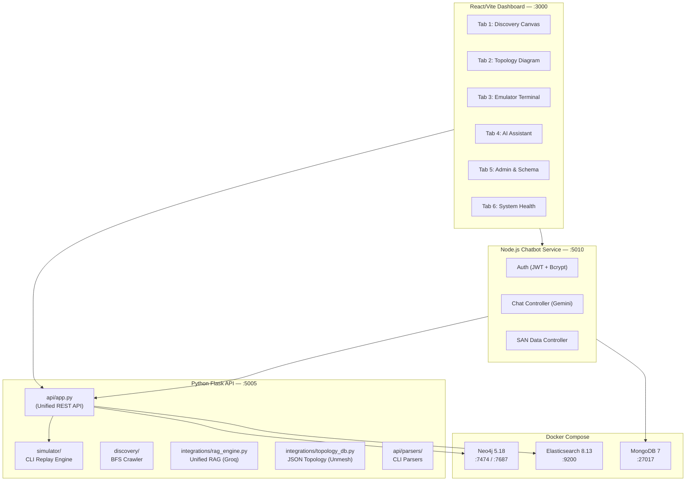

# HPE SAN Unified Monorepo — Full Integration Plan

## Background

Three independent projects need to be fully integrated into the existing `HPEFINALSCHEMA/monorepo`:

| Project | Owner | Backend | Frontend | DB | AI |
|---|---|---|---|---|---|
| **san-emulatoreditor** | Sachetan/Samarth | Flask (Python) — CLI proxy, parser, discovery, RAG | Vanilla HTML/JS — Terminal, Discovery, Editor, Graph | Neo4j + JSON Store | Groq LLM |
| **hpe-ontology-and-graph** | Unmesh | FastAPI (Python) — In-memory graph, LLM engine | Next.js (React/TS) — SAN Diagram, NodeCard, FieldManager, Admin, Decommission | JSON file (database.json) | Groq LLM |
| **Ring-Test-Management-Tool** | Preetham | Express (Node.js) — Auth, Chat, SAN data | React/Vite — ChatArea, RadialMenu, Sidebar, Login | MongoDB Atlas | Gemini/OpenAI |

The existing monorepo already has a **primitive integration** (working Flask API + React/Vite dashboard + Docker Neo4j). We will build upon it.

> [!IMPORTANT]
> The final product must have **NO dead code** — every module must be connected, and all features from all 3 individual projects must work together.

---

## User Review Required

> [!IMPORTANT]
> **API Keys & Secrets**: The plan consolidates all services to share these keys from a single `.env`:
> - `GROQ_API_KEY` — already in monorepo `.env`
> - `GEMINI_API_KEY` — from Preetham's `.env`
> - `MONGO_URI` — from Preetham's `.env` (MongoDB Atlas)
> - `JWT_SECRET` — for auth system
> - `NEO4J_*` — already in monorepo `.env` (Docker)
>
> Please confirm all keys should be reused as-is from the existing `.env` files.

> [!WARNING]
> **Authentication**: Preetham's project has JWT-based login/register via MongoDB. The plan adds an optional auth layer — users can login for chat history persistence, or use the platform without auth (guest mode). Confirm this is acceptable.

> [!IMPORTANT]
> **MongoDB addition to Docker Compose**: The plan adds a `mongo` service to `docker-compose.yml` so the project is fully self-contained (no Atlas dependency for local dev). The Atlas connection string will remain as a fallback. Confirm this is acceptable.

---

## Open Questions

1. **Ontology backend (FastAPI)**: Unmesh's project uses an in-memory graph loaded from `database.json` + a Groq LLM engine. Since the monorepo already has a Groq RAG engine (`rag_engine.py`) that queries Neo4j, should we:
   - **(A)** Merge both into a single RAG engine that queries both Neo4j (discovered data) and the JSON topology (static data)?
   - **(B)** Keep them as two separate chat endpoints behind a unified chat UI?
   - **Recommendation**: Option A — single unified RAG engine. Both data sources feed context.

2. **Decommissioned Inventory from Unmesh's project**: The data includes decommissioned switches (SW-DECOM-01, etc.) hardcoded in `sanDataLoader.js` and `database.json`. Should these be stored in Neo4j with an `is_decommissioned` flag, or kept as a separate JSON source?
   - **Recommendation**: Store in Neo4j with `is_decommissioned=true` flag for unified querying.

---

## Proposed Changes

### Architecture Overview



---

### Component 1: Docker Infrastructure

#### [MODIFY] [docker-compose.yml](file:///c:/Users/isach/OneDrive/Documents/HPEFINALSCHEMA/monorepo/docker-compose.yml)

Add MongoDB service and Kibana update:

```yaml
mongo:
  image: mongo:7
  container_name: hpe_mongo
  ports:
    - "27017:27017"
  volumes:
    - ./mongo/data:/data/db
  restart: unless-stopped
```

#### [MODIFY] [.env.example](file:///c:/Users/isach/OneDrive/Documents/HPEFINALSCHEMA/monorepo/.env.example)

Add all API keys:
- `GEMINI_API_KEY`
- `MONGO_URI` (default: `mongodb://localhost:27017/hpe_san`)
- `JWT_SECRET`
- `OPENAI_API_KEY` (optional)

---

### Component 2: Node.js Chatbot Microservice

Copy Preetham's entire `chatbot/backend/` into `monorepo/chatbot-service/`, adapted for monorepo integration.

#### [NEW] monorepo/chatbot-service/

Files to copy and modify from `Ring-Test-Management-Tool--HPE-CPP3/chatbot/backend/`:
- `server.js` → Update port to 5010, update CORS origins
- `config/db.js` → Read `MONGO_URI` from shared `.env`
- `controllers/authController.js` → As-is
- `controllers/chatController.js` → As-is (uses Gemini + SAN context)
- `controllers/sanController.js` → Modify to also fetch from Flask API (`localhost:5005`) for live discovery data
- `middlewares/` → As-is
- `models/` → As-is (User, Chat, SANData schemas)
- `routes/` → As-is
- `utils/aiProvider.js` → As-is (Gemini + OpenAI fallback + SAN context)
- `utils/sanDataLoader.js` → Modify to also pull live data from Flask `/api/graph/neo4j`
- `package.json` → As-is

Key change: `sanDataLoader.js` will **merge** its hardcoded SAN infrastructure data with live data from the Flask API's Neo4j store, giving the AI chatbot full context across both static topology and discovered devices.

---

### Component 3: Python Flask Backend Enhancements

#### [MODIFY] [api/app.py](file:///c:/Users/isach/OneDrive/Documents/HPEFINALSCHEMA/monorepo/api/app.py)

Add endpoints from Unmesh's FastAPI project:
- `GET /api/ontology/topology` → Serve `database.json` (Unmesh's topology data)
- `PATCH /api/ontology/nodes/<node_id>` → Update node properties + decommission toggle
- `POST /api/ontology/nodes` → Add new node
- `DELETE /api/ontology/nodes/<node_id>` → Delete node
- `POST /api/ontology/chat` → Unmesh's LLM engine (graph reasoning via Groq)

#### [NEW] api/integrations/topology_db.py

Port Unmesh's topology CRUD logic (currently in FastAPI's `app.py`) into a reusable module:
- Load/save `database.json`
- CRUD operations on nodes
- Decommission cascade logic

#### [NEW] api/integrations/ontology_engine.py

Port Unmesh's modules from `hpe-ontology-and-graph/backend/hpe_topology/`:
- `graph/core.py` → `InMemoryGraph`
- `graph/traversal.py` → BFS, hop counting
- `query/llm_engine.py` → Groq-powered natural language reasoning
- `data/graph_loader.py` → Load JSON → graph
- `data/database.json` → Copy to `monorepo/data/ontology/database.json`

#### [MODIFY] api/integrations/rag_engine.py

Enhance existing RAG engine to also query Unmesh's in-memory graph for comprehensive answers.

---

### Component 4: React Dashboard — Complete Rebuild with Tabs

This is the largest change. The dashboard will be rebuilt as a premium HPE-themed React app with 6 tabbed sections.

#### HPE Design System (Unified Theme)

Based on Preetham's HPE green palette merged with the existing monorepo dark theme:

```css
:root {
  /* HPE Brand Colors */
  --hpe-green: #01A982;
  --hpe-green-hover: #008767;
  --hpe-green-light: rgba(1, 169, 130, 0.15);
  
  /* Dark Theme (existing monorepo) */
  --background: #0d1117;
  --surface-1: #161b22;
  --surface-2: #21262d;
  --foreground: #e6edf3;
  --muted: #8b949e;
  --line: #30363d;
  
  /* Accent Colors */
  --accent-blue: #58a6ff;
  --accent-green: #3fb950;
  --accent-rose: #f85149;
  --accent-amber: #d29922;
  --accent-purple: #bc8cff;
  --accent-cyan: #39c5cf;
}
```

#### Tab Structure

| Tab | Source Project | Key Features |
|---|---|---|
| **🔍 Discovery** | Monorepo (Sachetan) | Live BFS discovery, SSE stream, animated topology canvas, discovery log |
| **🗺️ Topology** | Unmesh | React Flow SAN diagram, NodeCard, decommission panel, visual map, export |
| **💻 Emulator** | Sachetan | CLI terminal emulator, proxy engine, command execution on simulated devices |
| **🤖 AI Assistant** | Preetham + Unmesh | Full-page chat with sidebar, RadialMenu quick queries, Gemini+Groq AI, chat history (MongoDB) |
| **⚙️ Admin** | Unmesh + Monorepo | Add/delete devices, field schema manager, CSV ingest, synthetic data generator |
| **📊 Health** | Preetham + Monorepo | System health dashboard, capacity overview, problematic components, recommendations |

#### Dashboard Files to Create/Modify

##### [MODIFY] dashboard/package.json
Add dependencies:
- `react-router-dom` (tab routing)
- `react-markdown`, `remark-gfm` (already present)
- `lucide-react` (already present)
- `@xyflow/react` (already present)

##### [MODIFY] dashboard/src/main.jsx
Add `BrowserRouter` wrapper.

##### [NEW] dashboard/src/App.jsx (complete rewrite)
Top-level layout with HPE-branded header, tab navigation, and content routing.

##### [NEW] dashboard/src/components/layout/
- `AppShell.jsx` — Main layout with sidebar nav + header
- `TabNav.jsx` — HPE-styled tab navigation bar

##### [NEW] dashboard/src/pages/
- `DiscoveryPage.jsx` — Migrate existing TopologyCanvas + DiscoveryPanel + StatusBar
- `TopologyPage.jsx` — Port Unmesh's page.tsx (SANDiagram, NodeCard, SearchBar, DecommissionPanel, FieldManager, AdminPanel, ExportPanel, VisualMap)
- `EmulatorPage.jsx` — Port Sachetan's terminal/editor/graph views from `san-emulatoreditor/frontend/`
- `ChatPage.jsx` — Port Preetham's ChatArea + Sidebar + RadialMenu (full-page chat experience)
- `AdminPage.jsx` — Merge admin panels from monorepo + Unmesh (AdminPanel, FieldManager, CSV ingest, data faker)
- `HealthPage.jsx` — New dashboard with SAN health summary, capacity charts, recommendations

##### Components to port from individual projects:

**From Unmesh's frontend (`hpe-ontology-and-graph/frontend/app/components/`):**
- `SANDiagram.tsx` → Convert to JSX, update API URLs
- `NodeCard.tsx` → Convert to JSX
- `ChatPanel.tsx` → Merge into unified chat
- `DecommissionPanel.tsx` → Convert to JSX
- `ExportPanel.tsx` → Convert to JSX
- `FieldManager.tsx` → Convert to JSX (massive 14KB component)
- `AdminPanel.tsx` → Convert to JSX
- `VisualMap.tsx` → Convert to JSX
- `HierarchyTree.tsx` → Convert to JSX
- `SearchBar.tsx` → Convert to JSX
- `lib/mockData.ts` → Convert to JS types

**From Preetham's frontend (`Ring-Test-Management-Tool/chatbot/frontend/src/`):**
- `components/ChatArea.jsx` → Port as full-page chat (with CSS)
- `components/RadialMenu.jsx` → Port with CSS
- `components/Sidebar.jsx` → Port as chat sidebar
- `context/AuthContext.jsx` → Port for optional auth
- `context/ToastContext.jsx` → Port for notifications
- `pages/Login.jsx` → Port with CSS

**From existing monorepo dashboard (keep + adapt):**
- `TopologyCanvas.jsx` → Keep for Discovery tab
- `DiscoveryPanel.jsx` → Keep for Discovery tab
- `NodeTerminal.jsx` → Keep for Emulator tab
- `ChatPanel.jsx` → Merge into chat system
- `RadialMenu.jsx` → Replace with Preetham's version
- `AdminPanel.jsx` → Merge into Admin tab
- `StatusBar.jsx` → Keep for header
- `SearchBar.jsx` → Keep
- `FieldManager.jsx` → Replace with Unmesh's version
- `AggregateSidebar.jsx` → Keep for Discovery tab

##### [MODIFY] dashboard/vite.config.js
Add proxy for chatbot service:
```js
proxy: {
  '/api': 'http://localhost:5005',
  '/chatbot': 'http://localhost:5010',
}
```

##### [MODIFY] dashboard/src/index.css
Merge HPE green theme from Preetham's CSS with existing dark enterprise theme.

---

### Component 5: Data & Configuration

#### [NEW] data/ontology/database.json
Copy Unmesh's topology database (the "source of truth" for the ontology/topology tab).

#### [MODIFY] data/field_definitions.json
Merge Unmesh's 82-field schema definition for 7 entity types.

#### [NEW] data/san_infrastructure.json
Extract Preetham's hardcoded SAN data from `sanDataLoader.js` into a standalone JSON file so both Python and Node.js backends can reference it.

---

### Component 6: Interconnection Points (No Dead Code)

This is the critical "clockwork" that connects everything:

1. **Discovery → Neo4j → Topology**: When BFS discovery finds devices, they're stored in Neo4j. The Topology tab reads from Neo4j and renders them alongside the static `database.json` data.

2. **Neo4j → AI Chat**: Both RAG engines (Groq in Python, Gemini in Node.js) query Neo4j for live infrastructure context.

3. **Emulator → Discovery**: The CLI proxy/simulator feeds the discovery crawler. Discovered devices populate Neo4j.

4. **Admin → Neo4j + JSON**: The admin panel can add/edit/delete nodes in both Neo4j (discovered) and database.json (ontology).

5. **Chat History → MongoDB**: Chat conversations are persisted in MongoDB via the Node.js service, with authentication.

6. **Health → Neo4j + MongoDB**: The health dashboard queries both Neo4j (infrastructure state) and the SAN data store for recommendations.

7. **Decommission flow**: Marking a device as decommissioned in the Topology tab updates both `database.json` and Neo4j, and the Decommissioned tab shows historical records.

---

## Verification Plan

### Automated Tests
1. `py test_api.py` — Existing API tests (update for new endpoints)
2. `npm run build` in `dashboard/` — Verify React build succeeds with no errors
3. Health check: `curl http://localhost:5005/api/health` — Verify all services connected
4. Chatbot health: `curl http://localhost:5010/api/health` — Verify Node.js service + MongoDB + Gemini

### Manual Verification (Browser)
1. **Discovery Tab**: Click "Start Discovery" → watch BFS animate → nodes appear on canvas
2. **Topology Tab**: Verify SAN diagram renders with Unmesh's data, NodeCard works, decommission toggle works
3. **Emulator Tab**: Execute `showsys` on a simulated device → see parsed output
4. **AI Chat Tab**: Ask "What is the status of all storage arrays?" → get response with SAN context
5. **Admin Tab**: Add a new Host device → verify it appears in both Topology and Discovery views
6. **Health Tab**: Verify capacity stats, issue counts, and recommendations render correctly

### Integration Tests
1. Add a device via Admin → verify it shows in Discovery canvas
2. Run discovery → verify new nodes appear in Topology diagram
3. Ask AI about a discovered device → verify context-aware response
4. Decommission a device → verify it moves to Decommissioned tab and disappears from active views
